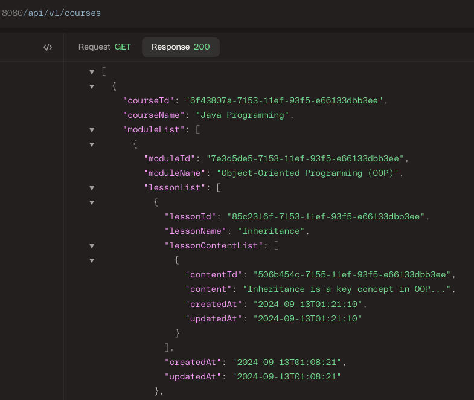

# Topicals API

A multi-author, modular learning content platform API.  
Authors can collaborate to write comprehensive educational material, focusing on modular lessons and standalone educational content.  

Topicals provides a structure for organizing content in a hierarchy of Course -> Module -> Lesson, allowing authors to
create and contribute content on either the Module or Lesson level.  
This system is particularly useful for educational platforms where collaboration and structuring knowledge is essential.

Deployed Site:

Project Blog:

LinkedIn Profile:  
https://www.linkedin.com/in/bradley-mwangangi/

GitHub Repository:  
https://github.com/aceof10

## Installation
To set up and run the project locally:
1. Clone the repository:  
    ``git clone https://github.com/aceof10/topicals.com.git``
2. Navigate to the project directory:  
    ``cd topicals-api``
3. Install required dependencies:  
    ``mvn install``
4. Set up your database environment and credentials.
5. Start the application:  
    ``mvn spring-boot:run``
6. Access the application at:  
    ``http://localhost:8080``

## Usage
Once the application is running, you can perform the following tasks:

- Authors can log in and submit their written content for Lessons or Modules
- The system picks up the logged-in author's information and associates the content accordingly.
- Explore the educational content under the structured hierarchy of Courses, Modules, and Lessons.

## Contributing
We welcome contributions to improve the platform. If you'd like to contribute:
1. Fork the repository.
2. Create a new feature branch.
3. Commit your changes.
4. Push the changes.
5. Submit a pull request for review.

## Related Projects
Here are some related projects that you might find interesting:

- [Open edX](https://openedx.org/): An open-source learning management system.
- [Moodle](https://moodle.org/): A free and open-source learning platform.

## Licensing
This project is licensed under the MIT License.
